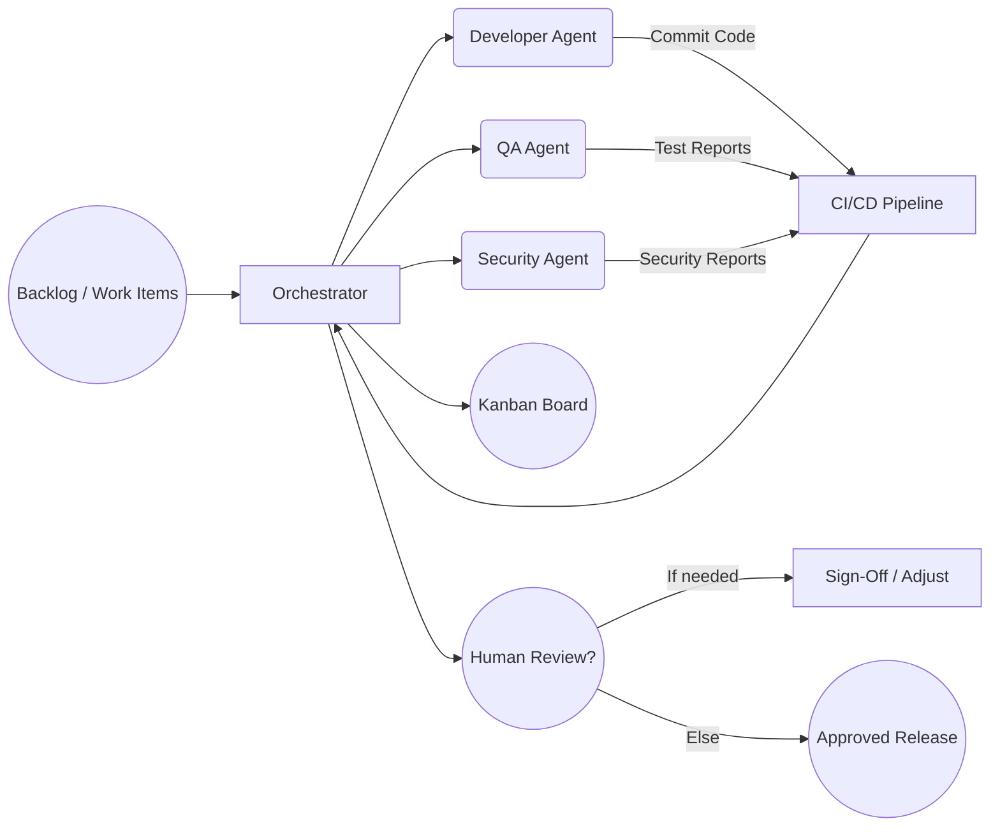
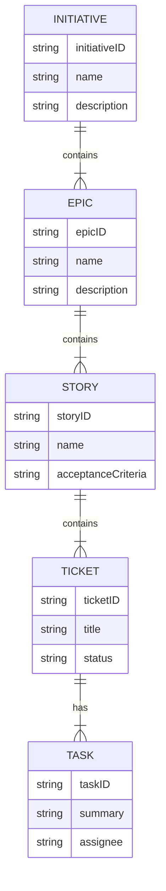
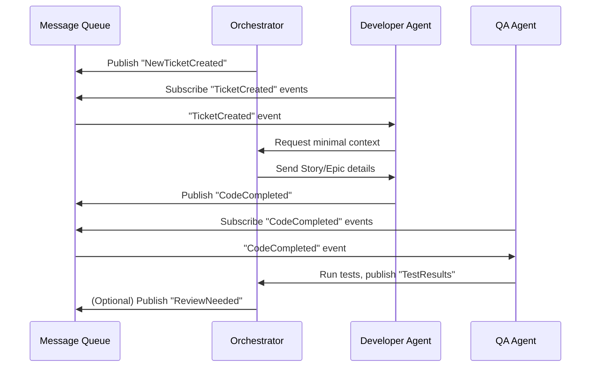
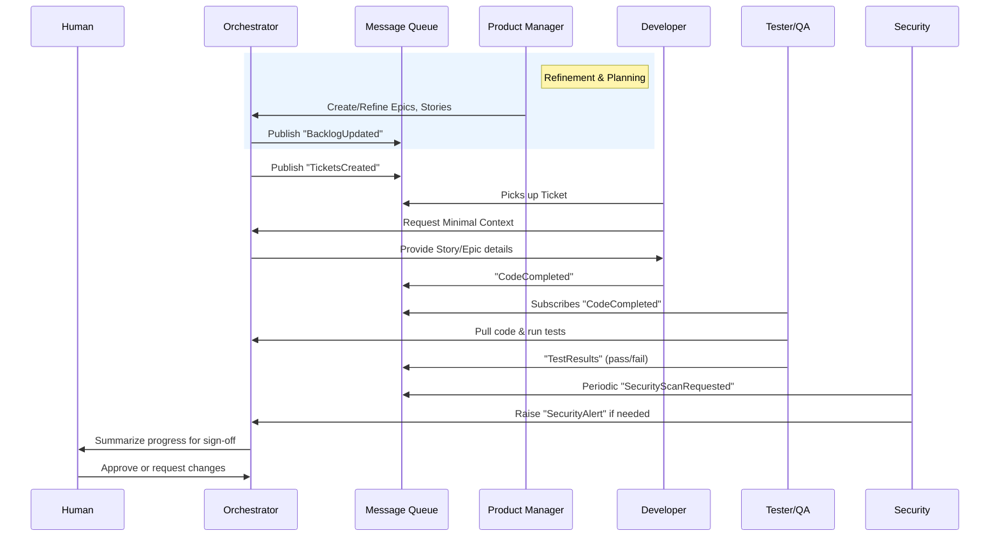

Below is an **updated version** of the **Orchestration & Coordination Protocol** that:

1. Introduces a new **Terminology & Definitions** section.  
2. Incorporates **relevant diagrams** (using Mermaid in GitHub-Flavored Markdown).  
3. Dives deeper into the **mechanisms of coordination and timing** (e.g., message-queue/event-based communications, avoiding single points of failure, and handling failed Agents).  

All code fences for diagrams are provided in **Mermaid** syntax, which can be directly rendered on GitHub or in Mermaid-compatible editors.

---

# **Orchestration & Coordination Protocol**

## 0. Terminology & Definitions

- **Agent**  
  An AI component specializing in a specific role (Developer, Tester, Designer, etc.). Agents receive **tasks** from the Orchestrator, produce **outputs** (e.g., code, design files, test reports), and communicate via **message-queue** events or through the Orchestrator.

- **Orchestrator**  
  The “meta-agent” or control center responsible for assigning tasks, tracking project state, resolving dependencies, and coordinating all Agents. It enforces concurrency rules, merges outputs, and queues tasks.

- **Work Items**  
  General term for the units of work in the project. May be subdivided as **Initiatives**, **Epics**, **Stories**, **Tickets**, **Tasks**, depending on complexity.

- **Message Queue**  
  The event-based communication channel. Agents and the Orchestrator publish and subscribe to relevant **events** (e.g., “TaskCompleted,” “NeedApproval,” “SecurityAlert”) without direct peer-to-peer coupling.

- **Graph / Hierarchy**  
  A structured way of representing the relationships among **Initiatives**, **Epics**, **Stories**, **Tickets**, **Tasks**, and their cross-dependencies.

- **Human Stakeholder**  
  The person (or persons) providing high-level direction, approving major changes, and ensuring the product aligns with strategic or ethical requirements.

---

## 1. Leveraging Lessons From Human Methodologies

Modern software development has evolved through various organizational structures and workflows. **Agile** methods emphasize iterative improvement, **Scrum** employs sprints and daily standups, **Kanban** focuses on flow and continuous delivery, while **Waterfall** represents more structured, sequential phases.

In an **AI-driven context**, we can extract and blend the core strengths of each approach:

1. **Kanban**  
   - **Key Lesson**: Visualizing flow and limiting work in progress (WIP) reduces context-switching and bottlenecks.  
   - **Adaptation**: The Orchestrator maintains a **task board** (virtual Kanban) with columns like “To-Do,” “In Progress,” “Waiting Review,” “Done.” Agents pick up tasks only when they can handle them without collisions.

2. **Scrum**  
   - **Key Lesson**: Time-boxed **sprints** and **daily standups** encourage incremental progress and communication.  
   - **Adaptation**: The Orchestrator can define **time-based** or **cost-based** sprints, scheduling automated “standups” (status checks) and prompting Agents (or the Human Stakeholder) for feedback at defined intervals.

3. **Agile / XP**  
   - **Key Lesson**: Iterative, user-focused development with continuous integration (CI) and test-driven development (TDD).  
   - **Adaptation**: The swarm of AI Agents **continuously** merges small changes, runs automated tests, and iterates on user feedback via a *message-queue pipeline*.

4. **Waterfall**  
   - **Key Lesson**: Clear **phase delineation** (requirements, design, implementation, verification, maintenance) can be essential for regulated industries.  
   - **Adaptation**: The Orchestrator can enforce explicit sign-offs (human or AI) before moving to the next phase—useful for compliance or major architectural changes.

### **Diagram: High-Level Process Flow**

- **Explanation**: Shows how the Orchestrator dispatches tasks to specialized Agents, collects results via CI/CD, updates the Kanban board, and involves humans for strategic decisions or final approvals.

---

## 2. Hierarchical Work-Item Graph & Cross-Dependencies

In many large-scale software projects, work items form a **hierarchical** or **graph** structure:

- **Initiative** (top-level strategic goal, e.g., “Expand into market X”)  
  - **Epic** (large, multi-sprint deliverable, e.g., “Implement Payment Gateway Support”)  
    - **Story** (feature-level requirement, e.g., “As a user, I can pay with PayPal”)  
      - **Ticket** (actionable unit of work, e.g., “Integrate PayPal SDK into checkout flow”)  
        - **Tasks** (atomic subtasks, e.g., “Write code to handle PayPal IPN,” “Update database schema,” “Add unit tests”)

### Protocol Adaptations

1. **Graph Representation**  
   - The Orchestrator maintains a directed acyclic graph (DAG) or tree of work items, with each node assigned to a specialized Agent or queued.  
   - **Cross-Dependencies**: If Story A depends on Story B, the Orchestrator enforces the correct order (no starting A before B is completed or stubbed).

2. **Minimal Context for Each Level**  
   - Agents only receive the relevant subset of the hierarchy. For instance, a Developer Agent working on a Ticket gets the associated Story and acceptance criteria, *not* the entire Initiative’s scope.

3. **Automated Dependency Management**  
   - Once an Agent finishes a Ticket, the Orchestrator updates the graph, unlocking any dependent items.  
   - Newly discovered dependencies or risks (e.g., from the Security Agent) get injected into the graph, potentially reordering tasks or pausing a sprint.

### **Diagram: Entity Relationship of Work Items**

- **Explanation**: Illustrates how each entity relates to the next (e.g., Epics contain multiple Stories, each Story can have multiple Tickets, etc.).

---

## 3. Human Feedback & Critical Timing

### Balancing Automation with Strategic Interventions

An **autonomous** swarm of AI Agents can produce large volumes of work quickly—but without **human oversight**, they risk going off-track. The protocol defines:

1. **Fixed “Gates” or Checkpoints**  
   - **Sprint Review**: Each sprint or time-box ends with a summary of major changes, test results, and open issues. The **human stakeholder** reviews or approves before proceeding.  
   - **Phase Sign-Off**: For waterfall-like sequences, transitioning from Requirements→Design→Implementation→Verification requires explicit sign-off (AI or human).

2. **Automated Summaries & Minimal Interrupts**  
   - The Orchestrator produces auto-generated reports at *pre-defined intervals* (daily, weekly) or *after major milestones*.  
   - **Targeted Alerts** (e.g., “Security Risk Found”) are escalated immediately. Otherwise, routine tasks proceed without constant human intervention.

3. **Pull vs. Push**  
   - **Pull**: Human stakeholders can request status on demand—view logs, real-time boards, or the message queue without halting progress.  
   - **Push**: Orchestrator sends notifications only for critical events (e.g., major collision, release candidate, compliance alarm).

---

## 4. Agent Role Specialization & Communication

Mirroring human teams, each **role** is an **AI Agent** focusing on a specific domain. Roles can be merged or expanded based on project needs.

### 4.1 Common Roles & Their Purposes

1. **Product Manager (PM) / Product Owner**  
   - **Responsibility**: Maintains overall product vision, defines Epics/Stories, prioritizes backlog items.  
   - **Agent Outputs**: User stories, acceptance criteria, ROI analysis.

2. **Business Analyst (BA)**  
   - **Responsibility**: Refines requirements, captures user needs, clarifies metrics.  
   - **Agent Outputs**: Detailed requirement docs, workflows, domain research.

3. **Designer (UX/UI)**  
   - **Responsibility**: Produces mockups, prototypes, style guides, accessibility checks.  
   - **Agent Outputs**: Figma/Sketch files, CSS frameworks, user journeys.

4. **Developer**  
   - **Responsibility**: Implements features, integrates APIs, refactors code.  
   - **Agent Outputs**: Source code, commits, integration scripts, unit tests.

5. **Tester / QA**  
   - **Responsibility**: Creates/runs test suites (unit, integration, performance, regression).  
   - **Agent Outputs**: Automated test scripts, coverage reports, bug tracking.

6. **Security Auditor**  
   - **Responsibility**: Scans for vulnerabilities, ensures compliance (e.g., GDPR, HIPAA).  
   - **Agent Outputs**: Security risk reports, recommended patches, compliance checklists.

7. **Project Manager** (Optional)  
   - **Responsibility**: In human teams, a PM handles scheduling and communication. In this framework, the **Orchestrator** largely covers this role. A separate PM Agent may help for advanced scheduling or multi-team orchestration.

### 4.2 Do We Need All Roles?

- **Small Projects**: Merge roles (e.g., a single Dev Agent might do basic QA).  
- **Large/Complex Projects**: Specialized Agents ensure high-quality outputs in each domain, adhering to best practices.

### 4.3 Event-Based Communication

1. **Orchestrator as Hub**  
   - The Orchestrator posts tasks or “events” to a **message queue** (e.g., “NewTicketCreated,” “ReviewNeeded”). Agents subscribe to relevant events.  
   - Agents publish completion events (e.g., “DeveloperTaskDone”) back to the queue.

2. **Transient Peer-to-Peer Channels**  
   - When needed, the Orchestrator can open a direct channel between two Agents (e.g., Developer↔Designer for rapid UI fix) but logs all messages for auditability.

3. **Fault Tolerance & Agent Replacement**  
   - If an Agent fails or becomes unresponsive, the Orchestrator can **spawn a new Agent** in the same role, passing along the minimal context needed.  
   - A keepalive or heartbeat event ensures Agents regularly confirm availability. If a heartbeat is missed, the Orchestrator triggers reassignment.

### **Diagram: Event-Based Coordination**

- **Explanation**: Shows how Agents and the Orchestrator interact primarily through the **Message Queue**, ensuring loose coupling and fault tolerance.

---

## 5. Coordination & Timing Details

This section dives deeper into **how tasks are defined**, **assigned**, and how the system avoids single points of failure.

### 5.1 Task Definition & Lifecycle

1. **Task Creation**  
   - A Ticket or Task is created (by the Orchestrator, Product Manager Agent, or discovered dependency).  
   - The Orchestrator assigns a **Task ID** and publishes an event (“TaskCreated”) on the queue.

2. **Assignment & Execution**  
   - Interested Agents (e.g., Developer Agent if the task is coding) pick up the event, claim it, and notify the Orchestrator to lock it (preventing multiple Agents from duplicating work).  
   - The Agent executes the task using only **minimal** relevant context.

3. **Completion & Review**  
   - Upon finishing, the Agent publishes a “TaskCompleted” event with references to outputs (e.g., code commits, test logs).  
   - The Orchestrator triggers any dependent tasks or reflection/QA checks.

4. **Failure & Reassignment**  
   - If an Agent fails (no heartbeat, error logs, or explicit crash), the Orchestrator cancels the in-progress task and republishes it as “TaskAvailable.”  
   - Another instance of the same role Agent can pick it up with minimal context.

### 5.2 Timing Mechanisms

- **Time-Boxed Sprints**: If using Scrum, tasks must be completed (or reprioritized) within the sprint window.  
- **Continuous Flow (Kanban)**: Tasks are continuously pulled from the queue whenever Agents are free.  
- **Heartbeat Intervals**: Agents periodically send “I’m alive” or “ProgressUpdate” events. If missed, Orchestrator reassigns tasks.

### 5.3 Avoiding Single Points of Failure

- **Distributed Orchestrator** (optional): In advanced deployments, the Orchestrator itself can be replicated or sharded, ensuring high availability.  
- **Message Queue Redundancy**: By using robust MQ technologies (e.g., RabbitMQ clusters, Kafka partitions), no single server crash loses data.  
- **Stateless Agents**: Agents rely on the Orchestrator for persistent state, so any Agent instance can pick up tasks as needed.

---

## 6. Bringing It All Together: Detailed Workflow Example

Below is a **step-by-step** scenario demonstrating how the swarm works in practice:

1. **Backlog Grooming**  
   - A *Product Manager Agent* and *Business Analyst Agent* collaborate to refine Epics & Stories.  
   - The Orchestrator organizes these items into the **Work-Item Graph** and publishes “BacklogUpdated” events.

2. **Sprint (or Cycle) Planning**  
   - The Orchestrator picks the highest-priority Stories, generating Tickets.  
   - The *Security Auditor Agent* may inject tasks like “Implement Data Encryption” if needed.  
   - The Orchestrator publishes “TicketsCreated” events to the message queue.

3. **Task Execution**  
   - A *Developer Agent* sees a coding ticket in the queue, requests minimal context from Orchestrator, and locks the ticket.  
   - The Developer Agent writes code, commits to version control, and publishes “CodeCompleted” with references to the commit.

4. **Automatic Testing**  
   - The *Tester/QA Agent* subscribes to “CodeCompleted.” Upon receiving it, the QA Agent pulls the latest code, runs tests, and updates coverage reports.  
   - If tests pass, the Orchestrator marks the Ticket as “In Review.” If failing, it publishes “TestFailed” for the Developer Agent to fix.

5. **Security & Compliance Checks**  
   - The *Security Auditor Agent* periodically scans new commits for vulnerabilities.  
   - If a vulnerability is found, it raises a “SecurityAlert,” prompting immediate triage.

6. **Human Checkpoint & Sign-Off**  
   - At the end of the sprint (or when an Epic is completed), the Orchestrator compiles a **Progress Report**.  
   - The Human Stakeholder reviews, approves, or requests changes. Critical or regulatory sign-offs are recorded as “PhaseApproved” events.

7. **Reflection & Retrospective**  
   - The Orchestrator or a specialized *Reflection Agent* evaluates performance metrics, test coverage, user feedback, and backlog churn.  
   - Insights are posted as “RetrospectiveReport,” shaping the next cycle’s improvements.

### **Diagram: End-to-End Workflow**

---

## **Conclusion**

By **fusing** human-proven methodologies (Kanban flow, Scrum sprints, Agile iteration, Waterfall gating) with:

- A **structured work-item graph** (Initiative→Epic→Story→Ticket→Task),  
- Carefully timed **human feedback loops**,  
- **Role-based Agent specialization**, and  
- **Event-based coordination** (message queue, fault tolerance, concurrency controls),

this **Orchestration & Coordination Protocol** achieves:

1. **High Throughput & Quality**: Autonomous Agents move quickly, but never blindly, thanks to continuous testing, security scans, and scheduled human checkpoints.  
2. **Scalability & Fault Tolerance**: Agents are stateless and can be replaced on the fly; the Orchestrator and message-queue design eliminate single points of failure.  
3. **Clarity & Transparency**: Every event (task creation, code completion, security alert) is logged, auditable, and traceable to a specific Agent or role.  
4. **Strategic Alignment**: Human stakeholders remain in control of **big-picture** direction, compliance sign-offs, and final approvals—ensuring the product aligns with real-world needs and ethical considerations.

The result is a **reliable, explainable, and transparent** AI development lifecycle—one that can scale from a single founder’s MVP to a massive enterprise product suite, unifying the **best of agile/lean methodologies** with **autonomous AI-driven execution**.
