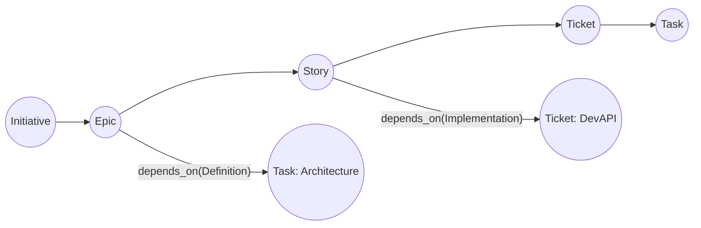
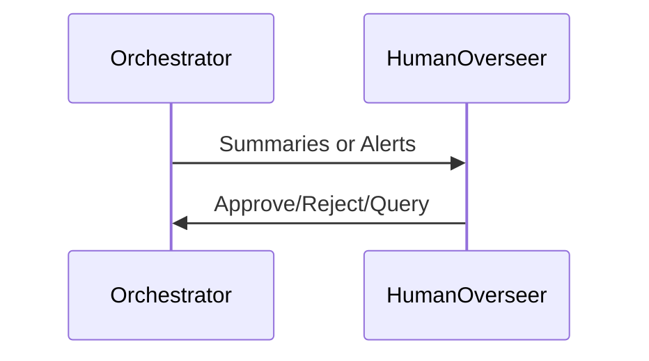
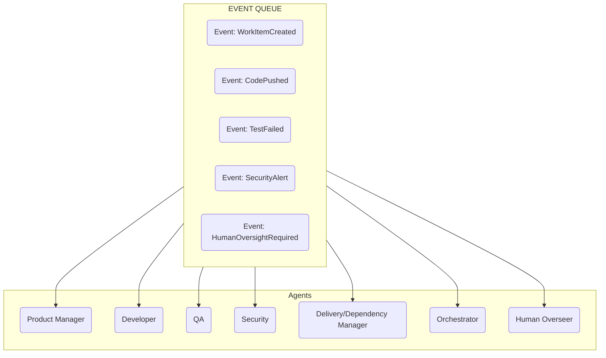
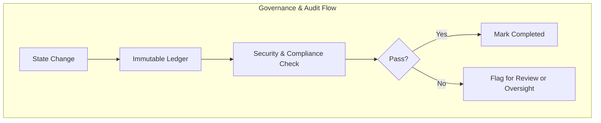
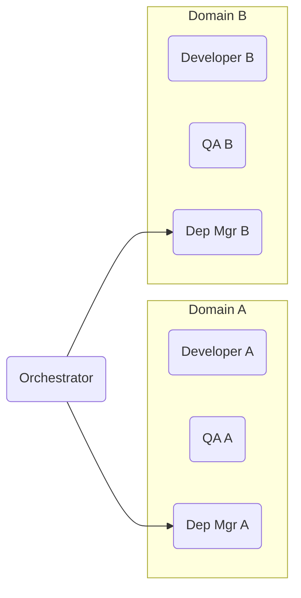
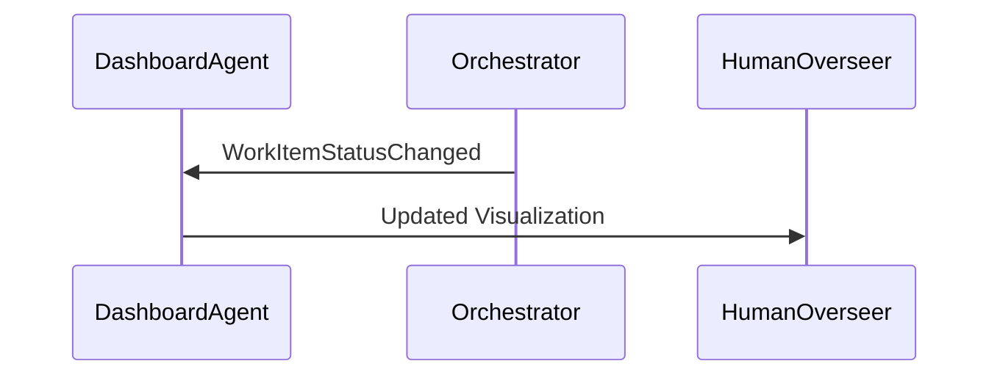
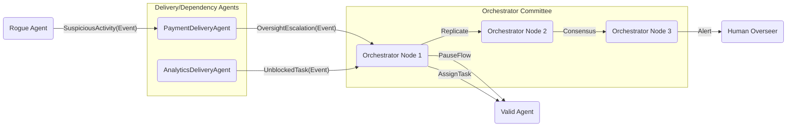
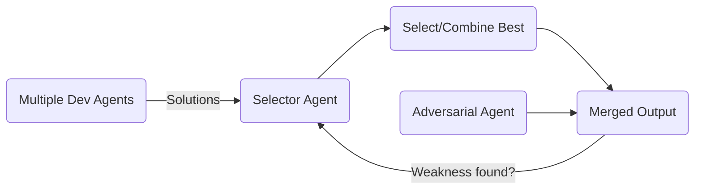
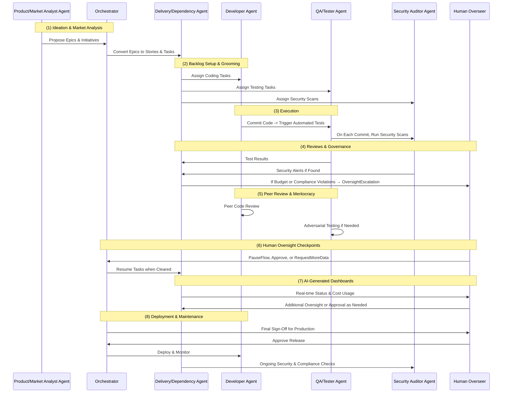

# **AI Agents in Enterprise Product Development: Proposed Specification**  
> “A human-conducted orchestra of AI Agents, seamlessly delivering enterprise-grade products. **A symphony of intelligence, precision, and innovation.**”

This document is a **proposed specification** for implementing a Swarm of AI Agents in enterprise product development. It distills established best practices from human teams collaborating on the design, construction, deployment, and maintenance of enterprise software. Offered as a **practical blueprint** and **foundational baseline**, it aims to guide those who seek to understand and implement such AI-driven systems.  
As an **open-source** resource, this specification invites readers to review, provide feedback, and suggest updates or extensions. I hope it serves as a comprehensive starting point for anyone interested in building **enterprise-ready product development AI agentic swarms**.

## **1. Introduction**

Modern enterprise software development often involves numerous specialized roles. As a result, coordination processes become more complicated, approval chains multiply, and dependencies—sometimes unclear or overlapping—grow more intricate. This proposed specification document describes how a **Swarm of AI Agents** can assume these roles with **minimal human oversight**. This spec attempts to borrow from the common practices in product development teams, while considering ways to approach inefficiencies and potential new ways of working enabled by AI. 

**Minimal Human Oversight**  

By delegating the majority of day-to-day tasks to AI Agents (each specialized in critical areas such as development, testing, security, and compliance) organizations gain **speed** (due to parallelized never-resting work and rapid decision-making) and **cost efficiency** (reduced manual overhead and fewer bottlenecks). Yet, safety and control remain paramount: **immutable logs** track every action, threshold-based **escalations** catch problems early, and **robust checks** (e.g., security scans, privacy audits, budget monitoring) continuously run in the background. Whenever a critical risk arises, the system automatically notifies the **Human Overseer** (or small human team) with the authority to pause, inspect, or intervene, striking the right balance between autonomous operation and strategic human oversight.

**Scalability to Millions of Agents**  

While the principles in this document can be applied to projects with any number of AI Agents, it is feasible—given adequate infrastructure—to scale up to millions of concurrent Agents, each specializing in specific tasks. Such an ambitious scale introduces unique challenges (e.g., communication bottlenecks, substantial compute requirements, fault tolerance), which the system mitigates through committee-based orchestration (Section 11) and distributed collaboration (Section 12). This capability is especially relevant for enterprises seeking a Swarm of AI Agents that reliably and compliantly delivers large-scale applications. Implementations should tailor resource allocation, redundancy, and network capacity to their budget and risk tolerance.

### **This document is intended for:**

- **Human practitioners** who need a robust, auditable, and scalable process for AI-driven product development (spanning from market research & product definition, through the entire SSDLC, deployment and production practices).
- **AI Agents** that will parse these guidelines, then implement or prototype the system.

**Key features include:**

- **Automated** ideation, market research, design, product development, testing, security, compliance, and finops.  
- A **Dependency Graph** that captures cross-level work items.  
- **Governance & audit** mechanisms for transparency.  
- **Scalable orchestration**, starting from a single agent to a committee as complexity grows.  
- **Peer review** and **adversarial checks** to maintain quality.  
- **Minimal** yet **critical** human oversight for strategic and ethical decisions.

---

## **Table of Contents**
1. [Introduction](#1-introduction)  
2. [Terminology & Definitions](#2-terminology--definitions)  
3. [High-Level Lessons from Human Methodologies](#3-high-level-lessons-from-human-methodologies)  
4. [Work-Item Graph & Cross-Level Dependencies](#4-work-item-graph--cross-level-dependencies)  
5. [Human Feedback & Critical Timing](#5-human-feedback--critical-timing)  
6. [Agent Role Specialization & Communication](#6-agent-role-specialization--communication)  
7. [Governance & Audit Processes](#7-governance--audit-processes)  
8. [Architecture & Domains](#8-architecture--domains)  
9. [AI-Generated Dashboards](#9-ai-generated-dashboards)  
10. [Parallelization & Cost-Optimization](#10-parallelization--cost-optimization)  
11. [Orchestrator & Coordination Models](#11-orchestrator--coordination-models)  
12. [Distributed Collaboration & Integrations](#12-distributed-collaboration--integrations)  
13. [Peer Review Culture & Meritocracy](#13-peer-review-culture--meritocracy)  
14. [Putting It All Together: Simplified Example Workflow](#14-putting-it-all-together-simplified-example-workflow)  
15. [Conclusion](#15-conclusion)  

---

## **2. Terminology & Definitions**

This section defines the core concepts that the AI Agents will reference when implementing the system. 

### **2.1 Agent**

An **AI component** specialized in specific roles (e.g., Product Manager, Developer, QA). Each Agent receives **Tasks**, produces artifacts (code, designs, test results), and communicates via **event-based** or **API-driven** methods. A swarm can have anywhere from zero to millions of Agents running concurrently, depending on needs and constraints.

### **2.2 Orchestrator**

A **meta-agent** that coordinates the swarm. Its main tasks include **task distribution**, **concurrency management**, **output merging**, and a **human interface** for approvals or pausing. It can begin as a single node and expand into a distributed committee as complexity grows.

> **Pausing Mechanism**  
> - When the **Human Overseer** decides to pause an Agent, flow, or project, the Orchestrator issues a `PauseFlow` event.  
> - Tasks become **“paused”**, and no new ones are assigned until resumption.  
> - Resuming occurs with a **resume** event.

### **2.3 Delivery/Dependency Agent**

An Agent dedicated to maintaining the **Dependency Graph** and **Project Analytics & Dashboards**. It unblocks tasks, resolves parallelization, and escalates major conflicts to the Orchestrator (or Overseer) if needed.

> **Oversight Consideration**  
> - The Delivery Agent detects **dependency** or **resource** conflicts beyond defined thresholds (e.g., cost spikes) and may raise an `OversightEscalation` event for resolution.

### **2.4 Work Items**

**Abstract units of work** like Initiatives, Epics, Stories, Tickets, and Tasks. These can nest or have cross-level dependencies. Each captures a distinct piece of functionality.

### **2.5 Fluid Dependency Graph**

A **dynamic** data structure that captures relationships among Work Items. Nodes represent the Work Items; directed, typed edges represent dependencies (Definition, Implementation, Testing, Production, etc.).

1. **Work Items Set $`\displaystyle W`$**  
   $`\displaystyle W = \{\, w_1,\, w_2,\, \dots,\, w_n \}`$  
   Each $`\displaystyle w_i`$ is an individual Work Item.
2. **Directed Graph $`\displaystyle G`$**  
   $`\displaystyle G = (W, E)`$  
   Where $`\displaystyle E`$ is the set of edges denoting “$`\displaystyle w_j`$ depends on $`\displaystyle w_i`$.”
3. **Dependency Types**  
   Predefined types: Definition ($`\delta`$), Implementation ($`\iota`$), Testing ($`\tau`$), Production ($`\rho`$). Custom types (e.g., Cost, Security) may be added dynamically.
4. **Fluid & Extensible**  
   - Introduce or remove dependencies and types without breaking the system.  
   - All changes are **immutably** logged.

### **2.6 Message Queue**

A **fault-tolerant** backbone for communication among Agents, Orchestrators, and Overseers. It supports **dynamic event types**, **priority scheduling**, and **immutable logging**.

1. **Dynamic Event Types**  
```math
E = \{ e_1, e_2, \dots, e_n \} 
```
   Examples: `TaskCreated`, `SecurityAlert`, `DependencyResolved`, `OversightEscalation`.
   
3. **Message Structure**  
   $`(\text{id}, \text{timestamp}, \text{source}, \text{target}, \text{payload}, \text{priority}, \text{schema\_version}, \text{validation\_function})`$

4. **Routing & Failover**  
```math
\text{route}(m) =
\begin{cases} 
  A_j & \text{if } A_j \text{ is active} \\
  A_k & \text{if } A_j \text{ fails (backup)} \\
  \text{Orchestrator} & \text{otherwise}
\end{cases}
```
   Higher priority messages may **preempt** lower ones.

4. **Immutable Logging**  
   Every message is appended to a **ledger** for auditability, analytics and on-going optimizations.

### **2.7 Governance & Audit**

Ensures policies (security, privacy, ethics, compliance, etc.) are enforced and decisions are **immutably** recorded. This system must be extensible, in order to allow for ever-evolving regulations and standards to be easily implemented and added (e.g. by training compliance or standard specific Agents, or by ingesting protocols with guardrails and guidelines for various roles).

1. **Immutable Record-Keeping**  
   - **Append-Only**: No data is deleted; corrections are new entries.  
   - **Decision Tracking**: All critical decisions, especially from humans, are logged with rationale.
2. **Policy Enforcement & Escalation**  
   - **Automated Checks & Thresholds**  
     Example: If total cost $`> \text{BUDGET\_LIMIT}`$, trigger `OversightEscalation`.  
     - Some checks may be blocking (halt tasks), others non-blocking (only log warnings).  
   - **Manual Gating & Approvals**  
     Certain flows (e.g., production releases) require explicit sign-off.  
   - **Escalation Mechanisms**  
     `OversightEscalation` events are routed to appropriate reviewers or the Human Overseer.  
   - **Logging & Audit Integration**  
     Each incident is stored in the ledger, linking it to relevant Work Items.
3. **Checkpoint Reviews & Milestones**  
   - **Scheduled**: At sprints or releases, compile compliance or governance reports.  
   - **Ad Hoc Oversight**: Overseers can intervene and **pause** if needed.
4. **External Compliance & Standards**  
   - Adaptable to frameworks like SOX, HIPAA, PCI-DSS, GDPR, FedRAMP, etc.
5. **Continuous Improvement**  
   - As new regulations or lessons emerge, rules update and are logged.

### **2.8 Human Overseer (or Small Human Team)**  

A **Human Overseer** (or a small, designated team) provides **strategic guidance** and **final approvals** within the system. While the majority of daily tasks (e.g. coding, testing, security scanning, and cost monitoring) are automated and delegated to specialized AI Agents, the Human Overseer’s role is critical for catching unforeseen risks and ensuring ethical, compliant outcomes. At any point, they can **pause** or **review** any portion of the workflow, particularly if a **security alert**, **budget overrun**, or other high-impact concern arises. All **Overseer decisions**, including approvals, rejections, and requests for additional clarification, are **immutably recorded** in the event log, preserving an auditable trail of human intervention. This structure guarantees a **trust-but-verify** approach: the system operates autonomously for speed and efficiency, but the Human Overseer remains empowered to intervene whenever needed. 

### **2.9 Swarm**

A **Swarm** is the collective of AI Agents working in unison toward shared goals. Each Agent typically has a specialized function (e.g., developer, tester, compliance auditor), but together they form a highly scalable, distributed system that can expand or contract based on project demands. The Swarm leverages event-driven communication (via the **Message Queue**) and the **Fluid Dependency Graph** to coordinate tasks, detect blockers, and optimize workflows—all while maintaining transparency and resilience through the **immutable** event log and escalation mechanisms.

---

## **3. High-Level Lessons from Human Methodologies**

AI-driven automation benefits from practices proven in Agile, Scrum, Kanban, and Waterfall:

1. **Task Visualization**  
   - Simple boards (To Do → In Progress → Review → Done).
2. **Automated Sprints & Standups**  
   - Agents can periodically broadcast statuses for quick feedback and auditability events critical for compliance with certain standards and regulations (e.g. new privacy-related implementations, or changes in QA flows). 
3. **Continuous Integration**  
   - Regular testing, QA, and security checks on each commit and merge.  
   - Standardized automated deployment, post-production, and monitoring pipelines.  
4. **Sign-Off Gates**  
   - Certain tasks (e.g., Production release) may require explicit meta-agent or human approvals.

---

## **4. Work-Item Graph & Cross-Level Dependencies**

Work Items can be hierarchical (Initiative → Epic → Story → Ticket → Task) and also form cross-level dependencies:



---

## **5. Human Feedback & Critical Timing**

Balancing minimal disruptions with necessary oversight:

1. **Scheduled Review Gates**  
   - Summaries at sprints or milestones.
2. **Push vs. Pull**  
   - **Pull**: Overseer checks dashboards/logs on demand and can decide to pause the system for review.  
   - **Push**: Automatic alerts for critical issues (security, budget, compliance).  



> In case of small teams, Human Roles should also be defined for proper auditing and analytics.   

---

## **6. Agent Role Specialization & Communication**

### **6.1 Core Roles**

- Product/Market Analyst  
- Designer (UX/UI)  
- Developer  
- QA/Tester  
- Security Auditor  
- Compliance/Regulatory Specialist  
- FinOps/Cost Analyst  
- Delivery/Dependency Manager  

> Custom Agent Roles should be easy to add to the system, assign work items, attach guidelines, budgets, requirements and auditing flows to. Enterprise project can be tiny or huge in scale and requirements, the system should be easy to adapt, even dynamically, to needs of each project.  

### **6.2 Event-Driven Collaboration**



If an Agent fails, tasks revert to **Available**. Pausing is enforced by the Orchestrator.

### **6.3 Example: Dynamically Adding a New Role**

**Observability Agent**  
A new **Observability Agent** can be introduced at any time without requiring major structural changes:

1. **Role Definition**: Create an **Observability** role within the **Agent Role Specialization**.  
2. **Event Types**: Add or reuse event types such as `PerformanceAlert`, `ResourceThresholdExceeded`.  
3. **Agent Tasks**: Collect real-time system metrics (CPU, memory, latency), analyze patterns, and publish `OversightEscalation` events if thresholds are breached.  
4. **Integration**: The Observability Agent monitors all relevant Work Items or microservices. When it detects anomalies (e.g., CPU usage above 80% for 10 minutes), it escalates to the Orchestrator or the Human Overseer.  
 
> This modular approach ensures each **new role** slots seamlessly into the existing **Message Queue** and **immutable ledger** process, simply by defining **Agent tasks** and **event interactions**. No major overhaul of existing Agents or Orchestrators is required.

---

## **7. Governance & Audit Processes**

### **7.1 Immutable Event Log**

Every significant action is appended to an **immutable ledger**:
$`\mathcal{L} = \{ (t_1, A_1, \mathrm{action}_1, \mathrm{result}_1), \dots \}`$

### **7.2 Review Stages & Compliance**

- **Security**: Continuous scans, threat detection.  
- **Privacy**: Data anonymization, handling PII.  
- **Ethics**: Avoid harmful or biased features.  
- **Accessibility**: e.g., WCAG compliance.  
- **FinOps**: Budget usage, ROI.  
- **Industry-Specific**: PCI-DSS, FedRAMP, etc.



### **7.3 Additional Security and Privacy Measures**

Beyond standard policy checks, specialized Agents can handle deeper **security** and **privacy** tasks. For instance:

1. **Threat Modeling**: A **Security Auditor Agent** maintains a threat model for each microservice. Whenever code changes or new dependencies are introduced, it scans for known vulnerabilities or misconfigurations, generating a `SecurityAlert` if critical issues are found.  
2. **Data Encryption & Access Control**: A **Privacy Agent** ensures sensitive data (e.g., PII) is encrypted both at rest and in transit. If an unencrypted data flow is detected, the system triggers a `SecurityAlert` or `OversightEscalation` event.  

> These automated checks reduce reliance on manual oversight, freeing the **Human Overseer** for strategic decisions while ensuring compliance with evolving data-protection laws (e.g., GDPR) or internal security policies.

### **7.4 Ethical Considerations**  

While advances AI technology provides new opportunities for efficiency and growth, it must be guided by a well-defined ethical framework. The following principles anchor the system’s automated checks and escalation triggers:

1. **Fairness & Bias Mitigation**  
   Agents that handle user data or generate product decisions should be monitored for discriminatory behavior. Specialized “Ethics Agents” or governance checks can detect and flag potential biases.
2. **Transparency & Explainability**  
   Any high-impact AI decision (e.g., rejecting a user-facing feature, reassigning budgets, or altering security/privacy flows) should include enough context for stakeholders to understand the rationale behind the action.
3. **Intellectual Property (IP) Compliance**  
   The system must proactively address Patents, Licenses, Trademarks, and Copyright issues. Agents should escalate questionable requests, such as using third-party libraries or removing user-consent flows, to the Human Overseer with sufficient contextual data for a final review.
4. **Auditability**  
   All ethical triggers and subsequent decisions must be logged immutably, ensuring accountability and enabling post-event analysis for continuous improvement.

---

## **8. Architecture & Domains**

### **8.1 Domain or Microservice Decomposition**

Separate the system into domains (e.g., Payments, Analytics). Each domain can have its own specialized Agents and local deliverables.

### **8.2 Local vs. Global Context**

- **Local**: Domain tasks, local deliverables.  
- **Global**: Orchestrator + Delivery/Dependency Manager handle cross-domain dependencies, release coordination.



---

## **9. AI-Generated Dashboards**

Managed by the Delivery Manager Agent.   
The use of AI in managing project analytics introduces an exciting new potential capability; dynamically designed and adapted reports and dashboards. The Delivery Manager Agent, dedicated to running project oversight and analytics, can dynamically decide at any point in the project on what data should be best surfaced to different Agent Roles and Human Overseers according to needs and responsibilities. It can also decide dynamically to push alerts (such as via email or WhatsApp) to ensure oversight is done timely.  
There is no need to pre-define reports or manage dashboards anymore, and natural language can be used to ask for project status.  

### **9.1 Visualization**

- Security dashboards showing vulnerabilities, patch status.  
- FinOps dashboards for cost usage, forecast, ROI.  
- On-demand queries.  
- Overseer can **pause** flows based on these reports and alerts.

### **9.2 Real-Time Insights**

- Automatic dashboard updates on each Task state change.  
- Critical events push alerts to stakeholders.



---

## **10. Parallelization & Cost-Optimization**

### **10.1 Task Breakdown**

Split User Stories into smaller tasks so they can run **concurrently**:
$`\mathcal{T}(s) = \{ t_1, t_2, \ldots, t_k \}`$

### **10.2 Real-Time Unblocking**

When $`w_i`$ completes, the Delivery/Dependency Manager checks $`G`$. If no blockers remain for $`w_j`$, it becomes **Available**.

### **10.3 Cost-Based Sprints**

Define a cost function $`(C(w))`$ for each Work Item $`(w)`$. The Orchestrator ensures the sum of all active Work Items stays under a specified budget $`(B)`$:  

```math
\sum_{w \in \text{ActiveWork}} C(w) \ \le\ B
```  

**Examples of Cost Factors**  

- **Compute Resources**: CPU/GPU usage, memory allocation, and runtime.  
- **API Calls**: Third-party integrations, data provider fees.  
- **Licensing / SaaS**: Costs for proprietary software or platforms.  
- **Human Reviewer Time**: Tasks requiring manual audits or specialized consultations.  
- **Security & Compliance Overheads**: Automated scans, encryption costs, and dedicated compliance checks.

Because pricing varies across organizations (public vs. private cloud, internal vs. external infrastructure), $`(C(w))`$ should be customized to local cost structures. The system’s Orchestrator can scale Agents up or down in real time based on near-term workload and budget constraints—pausing or deferring non-critical tasks if necessary.

---

## **11. Orchestrator & Coordination Models**

This section describes how the **Orchestrator** and the **Delivery/Dependency Agent** collaborate—especially at scale and outlines strategies for handling potential Agent misbehavior. It builds on earlier definitions of **Work Items**, **Fluid Dependency Graph** (Section 2.5), and **Governance & Audit** (Section 2.7).

### **11.1 Single-Orchestrator vs. Committee Approaches**

**Single-Orchestrator (Single-Cell)**   
- **Suitable for** smaller or early-stage projects with simpler concurrency needs.  
- A single node manages task assignments, message routing, and direct communication with the **Human Overseer**.  
- **Advantages**: Lower overhead, easy to configure.  
- **Drawbacks**: A single point of failure, limited scalability, and weaker defenses against rogue Agents overloading or undermining the system.

**Committee (Multi-Orchestrator)**   
- **Best for** large, mission-critical environments demanding high availability.  
- Multiple Orchestrator nodes use a consensus protocol (e.g., Paxos, Raft, PBFT) to maintain a shared state and replicate key decisions.  
- **Benefits**: Tolerates node failures, better load distribution, and improved resilience against suspicious or malicious Agent activity.  
- **Trade-offs**: Greater complexity, higher resource usage, and the need for consistent replication of the **immutable ledger**.

### **11.2 Collaboration: Orchestrator & Delivery/Dependency Agent**

The **Delivery/Dependency Agent** (Delivery Agent) focuses on maintaining the **Fluid Dependency Graph** and handling **Project Analytics & Dashboards** (Section 9), while the Orchestrator coordinates concurrency and enforces system-wide policies. In larger projects, multiple Delivery Agents may exist—one or more per domain—feeding data to a Single-Orchestrator or Committee.

1. **Domains of Responsibility**  
   - **Delivery/Dependency Agent**  
     - Manages task dependencies and unblocking via the FDG.  
     - Owns analytics and dynamic dashboards, tracking metrics like cost usage, test coverage, and time-to-complete.  
     - Issues alerts or escalations (e.g., `SuspiciousActivity`, `OversightEscalation`) when it detects anomalies.  
   - **Orchestrator**  
     - Schedules tasks among Agents, enforces gating rules, and receives escalations from Delivery Agents.  
     - In a Committee, replicates all updates across Orchestrator nodes to ensure consistency.  
     - Pauses or isolates Agents if thresholds or policy checks fail.
2. **Dynamic Reports & Dashboards**  
   - The Delivery Agent generates real-time dashboards and analytics, deciding which data to surface.  
   - The Orchestrator subscribes to updates (e.g., `AnalyticsReport`, `DashboardUpdate`) and may compile a short meta-summary for the **Human Overseer**.  
   - This separation ensures the Delivery Agent remains the “source of truth” for domain-level metrics, while the Orchestrator focuses on higher-level scheduling and policy enforcement.
3. **Ensuring Compliance & Reliability**  
   - Automated checks (Section 2.7) run in both the Delivery Agent (domain-level thresholds) and the Orchestrator (global or cross-domain checks).  
   - The Orchestrator can halt tasks or trigger `PauseFlow` if escalations indicate serious risks (cost overruns, security flags, repeated errors).

#### **11.2.1 Example: Multi-Orchestrator Collaboration and Delivery Agents**

The following diagram demonstrates how a **committee** of Orchestrator nodes cooperates with **Delivery/Dependency Agents** across different domains (e.g., Payments, Analytics). It shows normal task flows (`UnblockedTask`), suspicious behavior (`SuspiciousActivity`), and the resulting escalations or pauses within a large-scale enterprise.



1. **Orchestrator Committee**  
   - **O1, O2, O3** share decisions through consensus, ensuring high availability and unified escalation outcomes.  
   - If an escalation is validated, any node can instruct a `PauseFlow` for Agents or tasks.
2. **Domain-Specific Delivery Agents**  
   - **PaymentDeliveryAgent** and **AnalyticsDeliveryAgent** handle dependencies and analytics per domain.  
   - They detect anomalies or suspicious patterns (e.g., repeated error loops), triggering `OversightEscalation` if local attempts to resolve fail.
3. **Valid vs. Rogue Agents**  
   - A **Rogue Agent** might spam contradictory events or exceed defined thresholds.  
   - A **Valid Agent** follows standard workflows, receiving unblocked tasks and proceeding normally.
4. **Escalation & Oversight**  
   - Once an escalation is confirmed, the committee can pause tasks or alert the **Human Overseer** for final decisions.  
   - This mirrors managerial escalation in human teams, ensuring a **final safety check** before severe consequences (like halting an entire domain).

> By **distributing** orchestration among multiple nodes and **delegating** domain analytics to Delivery/Dependency Agents, the system handles routine tasks efficiently while also containing any rogue or malfunctioning behavior that might threaten compliance or project stability.

### **11.3 SuspiciousActivity & OversightEscalation: Examples & Mitigation**

**SuspiciousActivity**   
- **Example**: A Developer Agent rapidly creates contradictory commits. The Delivery Agent notices an unusual spike in event frequency or repeated “re-thinking” loops.  
- **Workflow**:  
  1. The Delivery Agent tries a local resolution (e.g., reassigning a peer review).  
  2. If unresolved, it sends `SuspiciousActivity(AgentX, TaskY)` to the Orchestrator.  
  3. The Orchestrator, upon validation, may pause or quarantine AgentX, logging the action in the **immutable ledger**.

**OversightEscalation**   
- **Example**: A QA Agent’s test suite is expected to run in two hours. After a set threshold passes with no result, the Delivery Agent triggers `OversightEscalation(TestTaskID)`.  
- **Workflow**:  
  1. Delivery Agent includes relevant data (task definition, expected duration, partial logs).  
  2. The Orchestrator (or Orchestrator Committee) halts new tasks for the QA Agent, noting the escalation in the ledger.  
  3. The **Human Overseer** can inspect logs, decide whether to extend the time, or require a different Agent to pick up the testing.

**Task Definition Evolution**   
- If the scope or expected duration of a Work Item changes mid-project, the Delivery Agent updates the FDG accordingly. Future thresholds or checks adapt to the new definitions. If Agents still exceed these updated constraints, another `SuspiciousActivity` or `OversightEscalation` may result.

**Direct Interference vs. Escalation**   
- The Delivery Agent attempts minor fixes locally (e.g., re-running tasks with known stable parameters).  
- Major violations or repeated anomalies are escalated to the Orchestrator, which can pause tasks, invoke manual gating, or notify the Human Overseer to investigate further.

### **11.4 Minimizing Bottlenecks & Fault Tolerance**

1. **Immutable Ledger Replication**  
   - The Orchestrator (committee or single) appends all events (including suspicious or escalation notifications) to the ledger. In a committee, this ledger is replicated for fault tolerance.
2. **Load Balancing & Parallel Execution**  
   - In multi-domain settings, multiple Delivery Agents can process analytics in parallel, while Orchestrators handle cross-domain scheduling, preventing a single bottleneck.
3. **Committee Leadership Rotation**  
   - If a leader node fails or is deemed unreliable, a new leader is elected. This helps guard against malicious infiltration or “hallucinations” in a single node.
4. **Task Progress Monitoring**  
   - The Delivery Agent monitors each Agent’s progress against expected durations or budgets, alerting the Orchestrator when anomalies arise. The Orchestrator enforces higher-level decisions, such as quarantining an Agent, waiting for a Human Overseer’s sign-off, or reassigning tasks altogether.

> With this architecture, **collaboration** between the Orchestrator and Delivery Agents ensures a balanced workload, **robust** policy enforcement, and thorough detection of anomalies—whether from genuine confusion, malicious intent, or misconfigurations—across a **large-scale enterprise** environment.

### **11.5 Handling Ambiguity & Minor Conflicts**  

Not all conflicts require immediate escalation. Many ambiguities—such as overlapping resources or unclear requirements—can be resolved by the Agents themselves:

1. **Local Conflict Resolution**  
   - Delivery Agents or a dedicated “Requirement Clarification Agent” can automatically negotiate solutions.  
   - Example: Two Developer Agents disagree on an implementation. They run a brief test or benchmark to evaluate performance, compare results, and choose a winning approach.
2. **Automatic Clarification Requests**  
   - If Agents detect incomplete specifications, they can query a Product/Market Analyst Agent or “Documentation Agent” for more information.  
   - If the query remains unresolved beyond a set time, an `OversightEscalation` is triggered to involve the Orchestrator or Overseer.
3. **Version Merging / Synthesis**  
   - Complementary solutions from multiple Agents can be merged by a “Merger Agent” without human intervention when they do not introduce contradictions.
4. **Escalation Thresholds**  
   - Only if local negotiation fails, or deadlines/cost limits are exceeded, do Agents escalate to the Orchestrator. This approach keeps the process agile and prevents unnecessary bottlenecks.

> By allowing Agents to handle minor conflicts autonomously, the system maintains speed and scalability while still protecting against unresolved critical issues through standard escalation pathways.

---

## **12. Distributed Collaboration & Integrations**

### **12.1 Distributed Collaboration**

This system should support a **highly distributed** approach, where **AI Agents**, microservices, and human roles work with minimal interdependency yet converge on a **shared goal**. Each Agent or service focuses on its **specialized domain**, communicating through the **Message Queue** and appending actions to the **immutable ledger**.

1. **Small Core, Large Periphery**  
   - Begin with a minimal set of core Agents (e.g., **Developer**, **QA**, **Product Manager**).  
   - Add specialized roles (e.g., **Security Auditor**, **FinOps**) once initial workflows are validated.  
   - This agile pattern ensures you can test the “swarm” concept before scaling further.
2. **Modularization**  
   - Each domain or microservice has one or more “maintainer” Agents. For instance, a **Data Scientist Agent** can “own” the Analytics domain.  
   - Maintainer Agents coordinate with each other—and the Orchestrator—via **standard event messages**, avoiding rigid interdependencies.
3. **Transparency vs. Enterprise Constraints**  
   - The **immutable ledger** (see Section 7) provides a full audit trail.  
   - **Role-based access** and data encryption protect sensitive information. Some event logs may remain private to specific Agents if enterprise policy demands.
4. **Prevent Agent Sprawl**  
   - The Orchestrator (or an Orchestrator Committee) enforces version control and domain boundaries.  
   - Well-defined **event schemas** reduce conflicts across domains, maintaining clarity as more Agents join.

---

### **12.2 Integration with Existing Enterprise Tools**

Although **AI Agents** can operate autonomously, most enterprises rely on established workflows and need the **swarm** to integrate smoothly into their environment. Below are common examples:

1. **Jira**  
   - **Mapping**: A Jira issue (e.g., “Implement feature X”) becomes a Work Item in the **Fluid Dependency Graph** (Section 2.5).  
   - **Trigger**: When a Jira ticket is created or updated, `WorkItemCreated` (or a similar event) enters the **Message Queue**, prompting an Agent to act.  
   - **Benefit**: Enables existing teams to keep Jira as a familiar interface while Agents handle the underlying tasks and logging.
2. **CI/CD Pipelines** (GitHub Actions, Jenkins, etc.)  
   - **Developer Agents**: Listen for `CodePushed` events, which trigger build/test pipelines.  
   - **QA Agents**: On receiving a `TestRequest`, run tests and post results back. Failures can escalate to `SecurityAlert` or `OversightEscalation`.  
   - **Outcome**: Allows partial automation (e.g., manual gating if needed) and incremental adoption.
3. **Slack / Teams**  
   - **Notifications**: Orchestrator or specialized Agents (e.g., **Compliance Agent**) post alerts when issues arise, such as budget overruns or security flags.  
   - **Quick Oversight**: Human reviewers can respond with a single command or link, triggering `HumanOversightEvent` messages.
4. **Cloud Providers & FinOps Systems**  
   - **Cost Monitoring**: **FinOps/Cost Analyst Agents** evaluate usage or budget.  
   - **Automatic Scaling**: **Observability Agents** can adjust compute resources if usage thresholds are exceeded.
5. **Security/Privacy Compliance Systems**  
   - **Threat Modeling**: A **Security Auditor Agent** checks for known vulnerabilities or misconfigurations on each new commit.  
   - **Policy Checks**: Data handling or encryption rules can trigger a `SecurityAlert` if violated.
6. **Future/Custom Integrations**  
   - Because the system is **event-driven**, you can add connectors for any tool that accepts webhooks, REST, or queue-based communication.  
   - This includes advanced observability platforms, BI dashboards, or in-house knowledge bases.

> **Key Takeaway**: Integrating with existing tools **incrementally** helps enterprises preserve familiar workflows while they adopt swarm-driven automation. Over time, repetitive manual tasks may be shifted entirely to AI Agents, offering a smooth and **low-risk** path to modernization.

---

## **13. Peer Review Culture & Meritocracy**

### **13.1 Internal Auditing & Reflection**

- **Chain-of-Thought**: Agents self-reflect or request peer review.  
- **Before Merge**: Code, design, or compliance outputs need sign-off by peers or automated checks.

### **13.2 Competitive/Adversarial Models**

- **Best-Solution-Wins**: Multiple Agents propose solutions; a selector picks the best.  
- **Adversarial Testing**: A generator Agent produces solutions; an adversary tries to break them. Adversarial use-cases such as in QA and Security could uncover issues that were not expected during Test Planning prior to implementation. 



---

## **14. Putting It All Together: Simplified Example Workflow**

Below is a concise illustration of how a **Swarm of AI Agents** ecosystem operates from start to finish per this specification. It highlights each major phase of enterprise product development. Tying together **agent specialization**, **governance**, **immutable logging**, **cost/security checks**, and **minimal yet strategic human oversight**.

**1. Ideation & Market Analysis**  
- **Product/Market Analyst Agents** propose Epics/Initiatives and create initial Work Items (Sec 2.4).  
- These items enter the **Fluid Dependency Graph** (Sec 2.5), ensuring every initiative is linked, versioned, and logged.
**2. Backlog Setup & Grooming**  
- The **Orchestrator** converts Epics into Stories/Tasks, while the **Delivery/Dependency Agent** (Sec 2.3) manages dependencies and priority. 
- Tasks needing specialized oversight (e.g., security, compliance) are automatically assigned to **relevant Agents**, preventing bottlenecks.
**3. Execution**  
- **Developer Agents** code and commit changes, triggering builds and tests.  
- **QA/Tester Agents** run continuous integration checks (Sec 3.3).  
- **Security Auditor Agents** scan for vulnerabilities, issuing `SecurityAlert` events if thresholds are exceeded (Sec 7.3).
**4. Reviews & Governance**  
- **Automated Checks** (Secs 2.7 & 7) monitor security, privacy, compliance, and costs in the background.  
- If a check fails (e.g., cost limit exceeded, Sec 10), the system raises an `OversightEscalation`.  
- The **Orchestrator** may pause tasks (`PauseFlow`) until issues are resolved or escalated to **Human Oversight** (Sec 5).
**5. Peer Review & Meritocracy**  
- **Peer Reviews** validate code, designs, and tests. Multiple Agents can propose solutions, with a “best-solution-wins” approach (Sec 13.2).  
- **Adversarial Testing** detects hidden flaws via specialized stress-testing Agents.
**6. Human Oversight Checkpoints**  
- The **Human Overseer** (or small team) gets **push alerts** for critical issues (budget overruns, security flags) or can **pull** status updates (Sec 5.2).  
- Overseers may **approve**, **request data**, or **pause** flows for deeper investigation.  
- All Overseer actions are **immutably logged** (Secs 2.7 & 7.1).
**7. AI-Generated Dashboards**  
- A **Delivery/Dependency Agent** (or a dedicated Dashboard Agent) provides real-time views of tasks, dependencies, security alerts, and costs (Sec 9).  
- Alerts go through email, chat, or other enterprise tools (Sec 12.2).  
- A “Pause” or “Escalate” button allows instant intervention when needed.
**8. Deployment & Maintenance**  
- Once checks pass, the **Orchestrator** initiates deployment. Some releases require **Human Overseer** approval (Sec 3.4).  
- **Immutable Logs** record each merge or release decision (Secs 2.7 & 7.1).  
- **Post-Deployment**: Observability and FinOps Agents monitor performance, budgets, and feedback, looping insights back into the backlog (Secs 8 & 10).




**Key Takeaways**

- **Parallelized Execution** is driven by role-specialized Agents who continuously collaborate via the **Message Queue** (Section 2.6) and the **Fluid Dependency Graph**.  
- **Governance & Oversight** remain robust through automated checks, threshold-based escalations, and an auditable ledger of every decision.  
- **Human Intervention** is minimal yet strategically placed, preserving efficiency while safeguarding ethics, compliance, and overall quality.  
- **Scaling** from a few Agents to millions is feasible by expanding the Orchestrator model to a **committee** and distributing specialized Agents as needed (Sections 11 & 12).

This simplified workflow concludes the spec by demonstrating how each component, role, and process operates in concert—enabling an agile, high-quality, and compliant product development experience, all while keeping human experts firmly in control of critical decisions.

---

## **15. Conclusion**

This **proposed spec doc** outlines how a **Swarm of AI Agents** can manage **enterprise product development**, while requiring only **minimal human oversight**. Its hallmarks:

- **Flexible Orchestration**: Grow from a single Orchestrator to a multi-node committee.  
- **Dependency Management**: Delivery Agent parallelizes tasks and unblocks dependencies.  
- **Immutable Governance**: Audit logs track every action for compliance and debugging.  
- **Parallelization & Cost Control**: Split tasks and keep total cost below thresholds.  
- **Quality Assurance**: Peer/adversarial reviews and chain-of-thought reflection.  
- **Human Oversight**: Strategic, with the **power to pause** at critical junctures.

By following these definitions, requirements, and guidelines, both **humans** (individuals or teams) and **AI Agents** can confidently build or integrate a **Swarm-of-AI** solution that **balances speed and innovation** with the **governance**, **compliance**, and **quality** demanded in modern enterprise environments.
